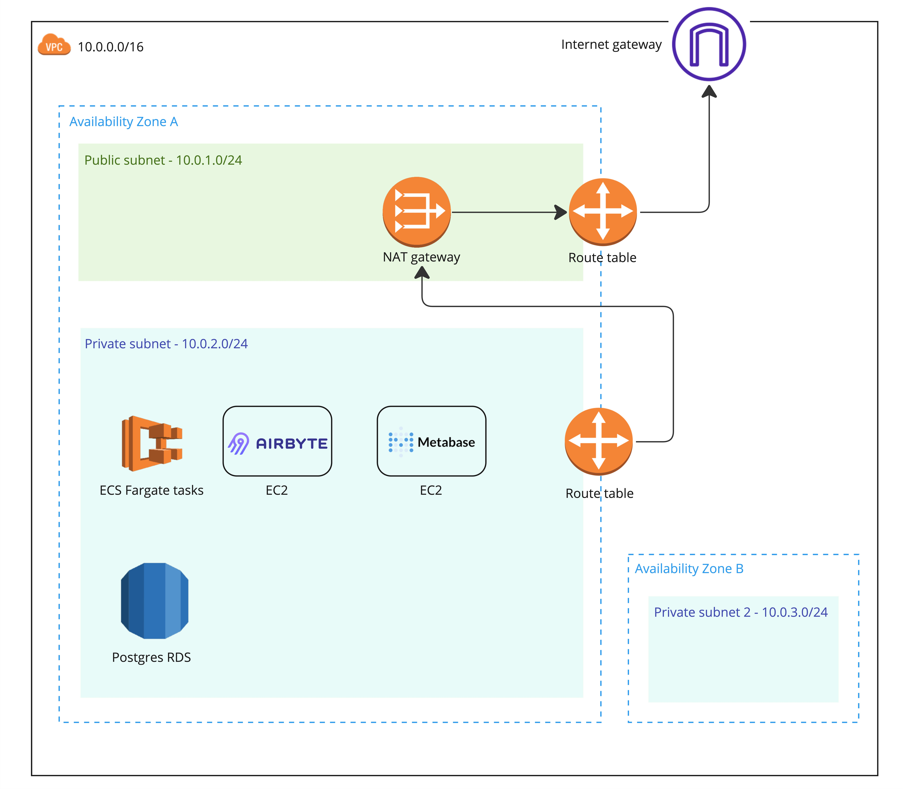

# Mini Modern Data Stack
Deploy a complete data stack that can run in production in just a couple of minutes.


## Infrastructure
The stack is made to be deployed on AWS and tries to be as simple as possible without compromising security
- instances are in a private subnet with no direct access to internet
- a NAT Gateway is used to enable instances to make request to external services
- SSH port on instance are not open
- connecting to an instance or using port forwarding is made through AWS Session Manager
(act kind of like a bastion)
- SSH keypair are still needed in order to execute ansible script on the instances
- secrets for ECS tasks are managed by AWS Secret Manager and injected securely at task launch
- there is 2 private subnets, because RDS always needs 2 subnets even if on a single-AZ deployment



## Deploying the stack

**Here are the prerequisis to run this deployment**
- an AWS account with AWS CLI configured
(follow [instruction here](https://docs.aws.amazon.com/cli/latest/userguide/getting-started-install.html)
then run `aws configure`) the AWS account needs to have a role that allow creating the necessary resources
- aws ssm plugin to securely manage instances
(follow [instruction here to install](https://docs.aws.amazon.com/systems-manager/latest/userguide/install-plugin-macos-overview.html)
and [here to setup your local ssh config accordingly](https://docs.aws.amazon.com/systems-manager/latest/userguide/session-manager-getting-started-enable-ssh-connections.html#ssh-connections-enable))
- a Pulumi cloud account in order to manage the state of your infrastructure.
It's completly free and you can do pretty much everything with the free tier
([create an account here](https://app.pulumi.com/signup))
- Pulumi CLI installed or your machine ([install the CLI](https://www.pulumi.com/docs/install/))
- the Docker daemon running on your computer


⚠️ Be careful to be on the right AWS profile (if you have several) when executing command.
If you need to switch profile, use the command below :
```bash
export AWS_PROFILE=<profile_name>
```

### 1. Set up the environment

Clone the repo and cd into it
```bash
git clone git@github.com:jeremySrgt/mini-modern-data-stack.git
cd mini-modern-data-stack
```

Execute the make script to create a python virtual env and create SSH keys
```bash
make setup
```

Activate the virtual env
```bash
source data_stack_venv/bin/activate
```

*Even if we won't expose the ssh port of our instances,
SSH keys are still needed to configure them with Ansible.*
*Don't worry there is a .gitignore rules to prevent them from getting pushed into Github*


### 2. Deploy the infra

Now cd into *stack > pulumi* and login into pulumi cloud with your credentials

``` bash
pulumi login
```

Create a stack named dev (actually, you can name it whatever you want, but you will need to set all the env var below
as default value will not exist for a different stack name)
```bash
pulumi stack init dev
```

#### 2.1 Set environment variable
You now need to set a couple of environment variable and secrets. Here is the list :

| Config name              | Required |     Default value      |                                  Description |
|--------------------------|:--------:|:----------------------:|---------------------------------------------:|
| region                   |   true   |       eu-west-3        |  the region where the stack will be deployed |
| env                      |  false   |          dev           |         name of the env you are deploying to |
| public_key_path          |  false   | ../../dev-keypair.pub  |   path to your public key (ending with .pub) |
| airbyte_instance_type    |  false   |       t3.medium        |                     type of Airbyte instance |
| metabase_instance_type   |  false   |        t3.small        |                    type of Metabase instance |
| warehouse_instance_class |  false   |      db.t3.micro       | type of RDS instance class for the warehouse |
| warehouse_db_name        |  false   | company_data_warehouse |                 name of the default database |
| dwh_master_user*         |   true   |                        |                  master user of the database |
| dwh_master_password*     |   true   |                        |       master user's password of the database |

To set a config variable :
```bash
pulumi config set <config_name> <config_value>
```

config name marked with a * are secrets and needs to be set as such :
```bash
pulumi config set --secret <secret_name> <secret_value>
```

#### 2.2 Deploy

Once it's all done you can first preview what will be deployed
```bash
pulumi preview
```

Then deploy everything
```bash
pulumi up --yes
```

> It takes about 10-15 minutes to deploy all the resources. it's actually deploying an RDS database that
takes a bit of time.

### 3. Configure Airbyte and Metabase

When it's done the last thing remaining is to configure our instances to deploy Metabase and Airbyte on it.

cd into the ansible directory then run the folllowing command :

```bash
ansible-playbook --private-key ../../dev-keypair -i inventories/dev/aws_ec2.yml playbooks/airbyte_playbook.yml
```
and
```bash
ansible-playbook --private-key ../../dev-keypair -i inventories/dev/aws_ec2.yml playbooks/metabase_playbook.yml
```
> It takes about 5-8 minutes to configure Airbyte. Metabase should be a bit faster

> Note that, by default, ansible will look for instance in eu-west-3 region,
if you are deploying on another region set the AWS_REGION env in your terminal session,
for example : `export AWS_REGION=eu-central-1`


🎉 If everything worked well, you should now have a complete mini data stack running on AWS,
that can sync data from sources to your warehouse, run dbt and python transformations,
and visualize data thanks to Metabase !

## Accessing Airbyte and Metabase
Airbyte and Metabase are quite sensible instances because they have access to your company's data.
That is why they are not exposed to the internet for security reason.
To access them you need something similar to an SSH tunnel to forward port.

Since we are using AWS Session Manager to manage our instance,
we can securely connect to them with the aws ssm plugin.
We just need the instance ID (pulumi returned it as an output after the deployment)

To start a port forwarding session :
```bash
aws ssm start-session --target <airbyte_instance_id> --document-name AWS-StartPortForwardingSession --parameters '{"portNumber":["8000"],"localPortNumber":["8000"]}'
```
**Remember to correctly install and setup the aws ssm plugin in order to connect to your instances and use port
forwarding capabilities. It basically means adding the following lines to your ~/.ssh/config**
```
host i-* mi-*
    ProxyCommand sh -c "aws ssm start-session --target %h --document-name AWS-StartSSHSession --parameters 'portNumber=%p'"`
```

Now you should be able to acces Airbyte on http://localhost:8000/

Do the same for Metabase, but replace the port number with `3000`


Learn more about [configuring Airbyte sync](https://airbyte.com/how-to-sync) and [setting up Metabase](https://www.metabase.com/docs/latest/configuring-metabase/setting-up-metabase)

> Don't close the aws ssm session until you are done working on your instances

## Monthly cost
*This estimate is based on eu-west-3 region with 10 ECS task running for 5 minutes each day, 1To of Go processed
and all the default instance type, without taking any free tier into account*

**152.2$/month**

*EC2 cost = 51$/month*

*RDS cost = 15$/month*

*Fargate task cost = 0.20$/month*

*NAT Gateway = 86$/month*


## Warning
You should know that with this deployment, Airbyte and Metabase don't have a database setup to store their configuration
and all user data. The only storage they have is the volume attached to their instance. It means that if you created
Questions and Dashboard with Metabase, and connection with Airbyte they could be lost if the volume is destroyed.

To prevent any unintended deletion of Metabase and Airbyte data, volume associated with their instances are kept even
if you destroy the Pulumi stack. Delete them from the aws console if you destroy the stack through Pulumi

It is recommended to set a proper database for Airbyte and Metabase to store their configuration and data.
You can learn more on how to do for Metabase 
[here](https://www.metabase.com/docs/latest/installation-and-operation/configuring-application-database)
and for Airbyte [here](https://docs.airbyte.com/operator-guides/configuring-airbyte-db)

## Destroying the stack 😢
if, for any reason, you want to destroy the stack and all the related resources
```bash
pulumi destroy
```
*Remember, you still need to delete the two volume associated with Airbyte and Metabase instance*

## Enhancements
Here is a list of enhancement to be made, either to follow engineering best practices or to make the stack more
resilient and scalable :

* [ ] Configure a CI/CD deployment of the stack 
* [ ] Tag docker image based on commit SHA, for better version tracking
* [ ] Migrate Metabase and Airbyte deployment to ECS for better resiliency and less instance
configuration (Airbyte doesn't support ECS out of the box for now, so it's a bit of a challenge)
